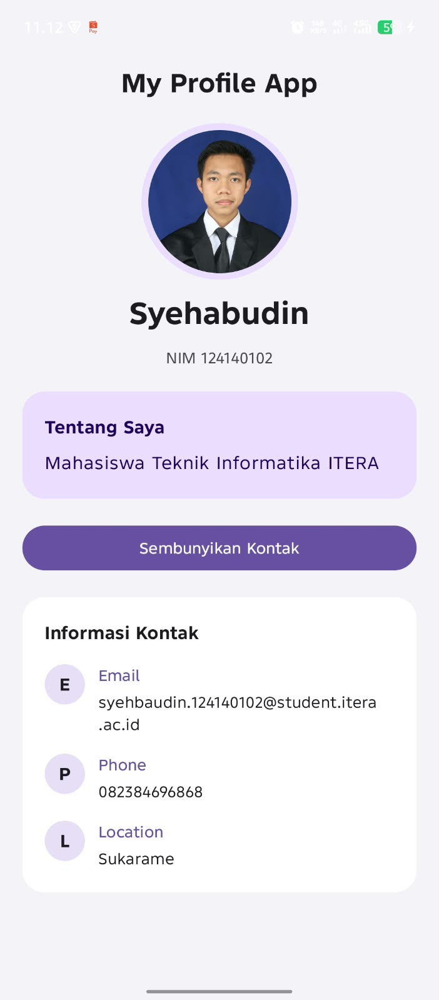

# My Profile App

Tugas Praktikum Pertemuan 3: Compose Multiplatform Basics  
Pengembangan Aplikasi Mobile 

**Nama:** Syehabudin  
**NIM:** 124140102  
**Kelas:** RB

## Deskripsi

My Profile App adalah aplikasi Android sederhana yang menampilkan profil diri. Aplikasi dibuat menggunakan Kotlin Multiplatform dan Compose Multiplatform.

Halaman profil berisi foto berbentuk lingkaran, nama, NIM, bio singkat, serta informasi email, nomor telepon, dan lokasi.

## Komponen Tampilan

| Komponen | Penggunaan |
| --- | --- |
| Column | Menyusun bagian profil secara vertikal |
| Row | Menyusun penanda dan teks informasi kontak |
| Box | Menempatkan foto dan penanda kontak |
| Card | Menampilkan bio dan informasi kontak |
| Text | Menampilkan identitas dan informasi profil |
| Button | Menampilkan atau menyembunyikan informasi kontak |
| Image | Menampilkan foto profil |

Modifier digunakan untuk mengatur ukuran, jarak, posisi, warna latar, dan bentuk lingkaran pada foto.

## Composable Reusable

| Fungsi | Kegunaan |
| --- | --- |
| ProfileHeader | Menampilkan foto, nama, dan NIM |
| ProfileCard | Menampilkan kartu dengan judul dan deskripsi |
| InfoItem | Menampilkan satu informasi kontak |

## Cara Menjalankan

1. Buka folder proyek melalui Android Studio.
2. Tunggu Gradle Sync selesai.
3. Pilih konfigurasi **androidApp**.
4. Pilih emulator atau HP dengan USB debugging aktif.
5. Klik **Run**.

## Build

Jalankan dari terminal pada folder utama proyek:

```powershell
.\gradlew.bat :androidApp:assembleDebug
```

Build telah berhasil dengan hasil `BUILD SUCCESSFUL`.

## Screenshot Aplikasi

